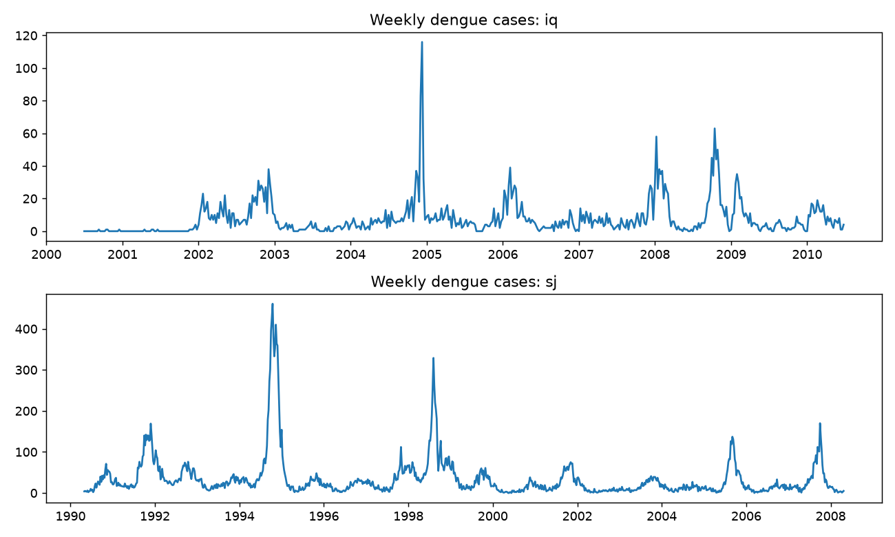
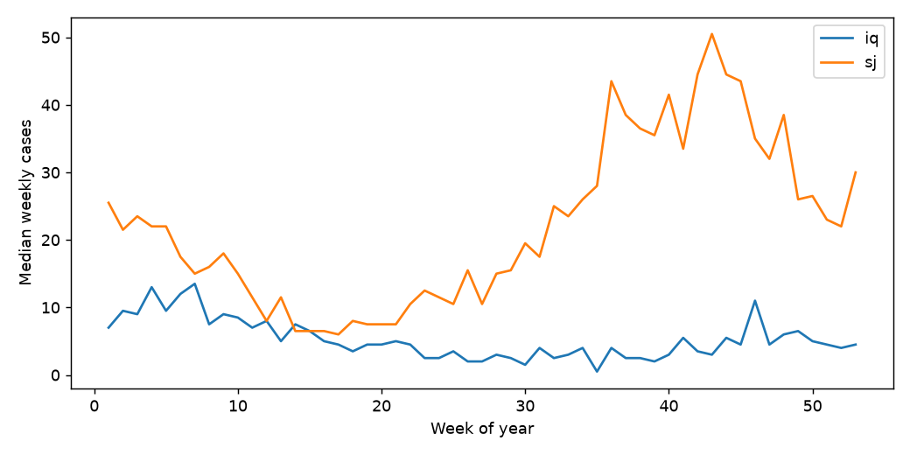
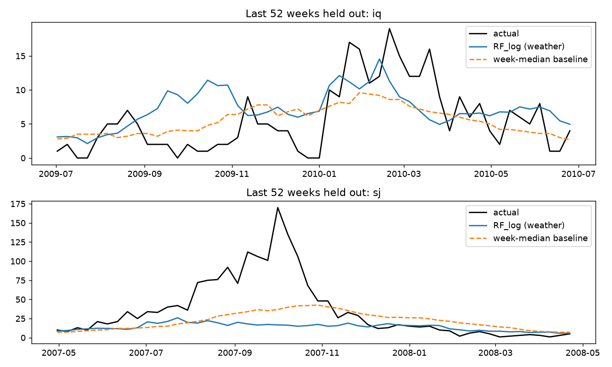

# DengueForecast: Can Weather Forecast Dengue Cases?

A time-series study on the DrivenData **DengAI** data (San Juan, Puerto Rico and Iquitos, Peru). It asks a simple question: **do weather and vegetation data predict weekly dengue cases better than a plain seasonal average?**

> **Key finding:** no. Across 6 rolling-origin folds, models built on weather features beat a seasonal-median baseline by only about 0 to 2.5% in MAE, which is within fold-to-fold noise. None of the models predicted the size or timing of outbreak peaks.

This is a negative result, reported as such. The value of the project is the evaluation: strict time-based validation, honest baselines, ablations and paired comparisons.

---

## Data

| Item | Detail |
|---|---|
| Source | DrivenData competition "DengAI: Predicting Disease Spread" |
| Cities | San Juan (936 weeks, 1990-04-30 to 2008-04-22), Iquitos (520 weeks, 2000-07-01 to 2010-06-25) |
| Target | `total_cases` per week |
| Features | NOAA/NASA climate variables (temperature, humidity, dew point, precipitation) and satellite vegetation index (NDVI) |
| Metric | Mean absolute error (MAE), reported per city because the case scales differ |

| | Mean cases/week | Median | Max |
|---|---|---|---|
| San Juan | 34.2 | 19 | 461 |
| Iquitos | 7.6 | 5 | 116 |

**The competition data is not included in this repository.** Download it from the DrivenData competition page (free account, join the competition) and place the CSV files in the project folder.

### Data issues handled
- Missing values (for example `ndvi_ne` has 194) are forward-filled **within each city** from the previous known week only. Interpolation was avoided because it uses future values. Remaining gaps use the training-set median.
- Weekly spacing is regular (a few 8 and 9 day gaps, no missing weeks).
- Iquitos has near-zero cases in 2000 to 2001. Whether this reflects reporting is unknown, so it was left in.

## Method

**Features** (built from past data only): for 10 weather/vegetation variables, the 4-week rolling mean, the same mean shifted by 4 weeks and by 8 weeks (to capture a delay between weather and cases), plus week-of-year as sine and cosine. The first 12 weeks of each city are dropped to make room for lags.

**Task design:** the competition test set is 3 to 5 years in the future, so recent case counts are not available. The task is therefore forecasting from **weather only**.

**Models:** Random Forest and Gradient Boosting (MAE loss), with a log-transformed target for the forest and Ridge. A plain Random Forest on the raw target was hurt badly by outbreaks (35% worse than the constant-median baseline in San Juan).

**Baselines:** constant median, median by week of year, and a smoothed week-of-year median.

**Validation:** expanding-window, rolling-origin. The test window is always after the training data. Random splits were not used because they leak the future.
- Step 1: 3 folds of 104 weeks.
- Step 2: 6 folds of 52 weeks, with ablations (season only, no NDVI, full) and a blend of model and baseline.

## Results

### Average MAE, 3 folds of 104 weeks

| Model | Iquitos | San Juan |
|---|---|---|
| Constant median | 7.40 | 17.91 |
| Week-of-year median | 7.24 | 17.13 |
| Gradient Boosting (MAE loss) | 6.67 | 18.16 |
| Random Forest (log target) | 6.73 | 17.32 |
| Ridge (log target) | 6.87 | 18.51 |
| Random Forest (raw target) | 6.87 | 24.19 |

### Mean MAE, 6 folds of 52 weeks

| Model | Iquitos | San Juan |
|---|---|---|
| Constant median | 7.21 | 17.78 |
| Smoothed week-of-year median (baseline) | 6.98 | 16.89 |
| RF log, season only | 7.12 | 17.40 |
| RF log, no NDVI | 6.88 | 16.62 |
| RF log, full | 6.81 | 16.85 |
| GBR (MAE loss), no NDVI | 7.24 | 18.15 |
| GBR (MAE loss), full | 7.04 | 18.43 |
| Blend (RF log full + baseline) | 6.80 | 16.67 |

### Paired comparison against the smoothed seasonal baseline

Negative difference means the model is better. SE is the standard error across the 6 folds.

| Model | Iquitos mean diff (SE) | Iquitos folds better | San Juan mean diff (SE) | San Juan folds better |
|---|---|---|---|---|
| RF log, season only | +0.14 (0.07) | 1/6 | +0.51 (0.34) | 2/6 |
| RF log, no NDVI | -0.10 (0.30) | 3/6 | -0.27 (1.21) | 3/6 |
| RF log, full | -0.16 (0.24) | 3/6 | -0.04 (0.98) | 2/6 |
| GBR, full | +0.06 (0.50) | 3/6 | +1.54 (2.11) | 2/6 |
| Blend | -0.17 (0.10) | 4/6 | -0.22 (0.51) | 3/6 |

Every difference is within about two standard errors of zero, and the best models win in only 3 or 4 of 6 folds.

### What this shows
- **No reliable winner.** Weather features add at most a few percent over a seasonal average, which cannot be separated from noise.
- **The gain shrank as evidence grew.** In Iquitos, with 3 folds the best model looked about 6% better than the best baseline. With 6 folds it was about 2% better.
- **Weather versus season alone:** in Iquitos the full model was about 0.3 MAE better than season-only (SE about 0.2). In San Juan the difference was about 0.55 (SE about 0.9).
- **NDVI is not a reliable signal.** Random Forest importance in San Juan was dominated by one NDVI feature (0.30), but removing NDVI did not hurt and slightly improved MAE (16.85 to 16.62). Feature importance is not predictive value.
- **Errors are large relative to the data:** MAE is roughly half the mean weekly cases in San Juan and close to the mean in Iquitos.




San Juan cases peak between weeks 36 and 46, while Iquitos is flat with small bumps at the start and end of the year, so the two cities need separate models.

### Forecast versus actual (last 52 weeks of each city)



In San Juan, the 2007 outbreak peaked near 170 cases a week. Both the weather model and the baseline stayed far below it. In Iquitos the model partly follows the early-2010 rise but over-predicts from September to November 2009. This shows only the last fold, not all six.

Likely reason (a hypothesis, not tested here): outbreaks depend on factors that weather data do not contain, such as population immunity after earlier outbreaks and which virus type is circulating.

## Dashboard

```
streamlit run app.py
```

| Tab | Content | Needs |
|---|---|---|
| Cases explorer | Weekly cases per city with a range slider, median cases by week of year | Raw competition CSVs |
| Backtest | Pick a city and a held-out window, overlay model forecasts against actual cases (models are refitted on the weeks before the window) | Raw competition CSVs |
| Model comparison | Mean MAE with error bars, paired difference against the seasonal baseline with a "within noise" verdict, per-fold MAE | `dengue_cv6.csv` |
| About | Design, validation and limitations | none |

Without the raw CSVs (they are not in this repository), the first two tabs fall back to the saved figures and the other tabs work as normal.

## Repository structure

```
.
├── dengue_forecast.py       # EDA, baselines, models, ablations, figures
├── app.py                   # Streamlit dashboard
├── dengue_cv6.csv           # per-fold MAE for every model and city
├── cases_by_city.png
├── seasonal_profile.png
├── forecast_vs_actual.png
├── requirements.txt
└── README.md
```

## How to reproduce

```bash
pip install -r requirements.txt
```

1. Download `dengue_features_train.csv` and `dengue_labels_train.csv` from the DrivenData competition into the project folder.
2. Run `python dengue_forecast.py`, then `streamlit run app.py`.

## Limitations

- Two cities only, and a benchmark dataset rather than an operational system.
- Weather-only, long-horizon design. Using recent case counts for short-horizon forecasts is a different and probably easier task.
- 6 folds is still a small number of evaluation windows, and outbreak years dominate the error.
- MAE is the only metric. There are no prediction intervals.
- No competition leaderboard score is reported.
- Reported cases are not true infections.

## Next steps

- Short-horizon forecasting (1 to 4 weeks ahead) with recent cases as features.
- Count models (negative binomial) and prediction intervals.
- Test the outbreak-immunity hypothesis by adding a "cases in the last 52 weeks" feature.

## Data and licence

Data belongs to DrivenData and the competition organisers and is subject to the competition rules. It is not redistributed here.

## Author

Wasim Akram Janyaro | Software Engineering graduate, Mehran University of Engineering and Technology 
[waseemjanyaro@gmail.com]
